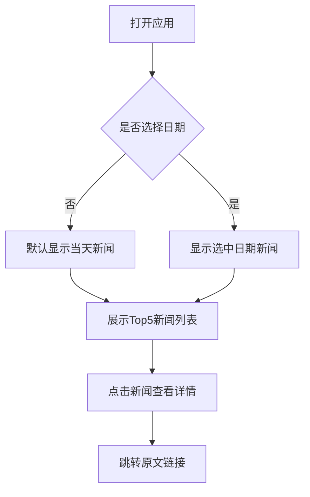
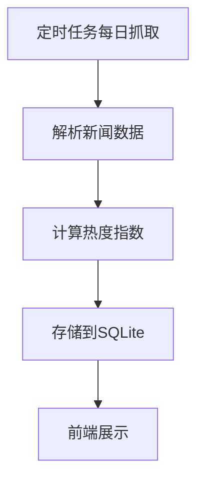

# AI新闻热点 - 产品需求文档

## 1. 产品概述

每日AI新闻热点聚合应用，通过爬取各大科技媒体的AI相关新闻，计算每篇新闻的热度指数，展示当日最热的5篇AI新闻，并支持按日期查看历史新闻。

- **核心目的**：帮助用户快速了解每日最重要的AI动态
- **目标用户**：AI从业者、科技爱好者、投资者
- **产品价值**：节省用户筛选信息的时间，第一时间掌握AI领域热点

## 2. 核心功能

### 2.1 用户角色
| 角色 | 说明 | 核心权限 |
|------|------|---------|
| 访客 | 无需登录 | 浏览当日热点新闻、历史新闻 |

### 2.2 功能模块

1. **首页** - 展示当日热度最高的5篇AI新闻
2. **历史浏览** - 通过日期选择器查看任意日期的新闻

### 2.3 页面详情

| 页面名称 | 模块名称 | 功能描述 |
|---------|---------|---------|
| 首页 | 日期导航 | 显示当前日期，支持切换到历史日期 |
| 首页 | 热点新闻列表 | 展示热度最高的5篇新闻卡片 |
| 首页 | 新闻卡片 | 包含标题、来源、热度指数、发布时间、摘要 |

## 3. 核心流程

### 3.1 主流程

### 3.2 数据更新流程

## 4. 用户界面设计

### 4.1 设计风格

- **风格定位**：极简现代科技风，以内容为核心
- **配色方案**：
  - 主色：`#1a1a2e` (深空蓝)
  - 强调色：`#00d4ff` (科技蓝)
  - 背景：`#0f0f1a` (深色背景)
  - 文字：`#e0e0e0` (浅灰白)
- **字体**：使用等宽字体展示技术内容，增强科技感
- **布局**：单栏卡片式，清晰的信息层次
- **动效**：卡片悬停时的微妙发光效果，页面切换的淡入淡出

### 4.2 页面设计

| 页面 | 模块 | UI元素 |
|------|------|--------|
| 首页 | 日期选择器 | 日历图标 + 日期显示，点击展开选择 |
| 首页 | 新闻卡片 | 热度排名、数字热度值、标题、来源标签、发布时间、摘要 |

### 4.3 响应式设计

- 桌面端：卡片式布局，最大宽度1200px
- 移动端：单列布局，全宽卡片，触控优化

## 5. 数据来源

新闻数据来源于公开RSS源和新闻API，确保内容合法性。

## 6. 部署说明

由于本应用为Spring Boot + Vue全栈应用，需要服务器环境运行：
- **GitHub Pages**：仅支持静态网站，无法部署Spring Boot后端
- **推荐方案**：
  1. 使用 Railway、R Render、F ly.io 等平台部署
  2. 使用 GitHub Codespaces 云开发环境
  3. 本地运行：`mvn spring-boot:run` 启动后端，`npm run dev` 启动前端
