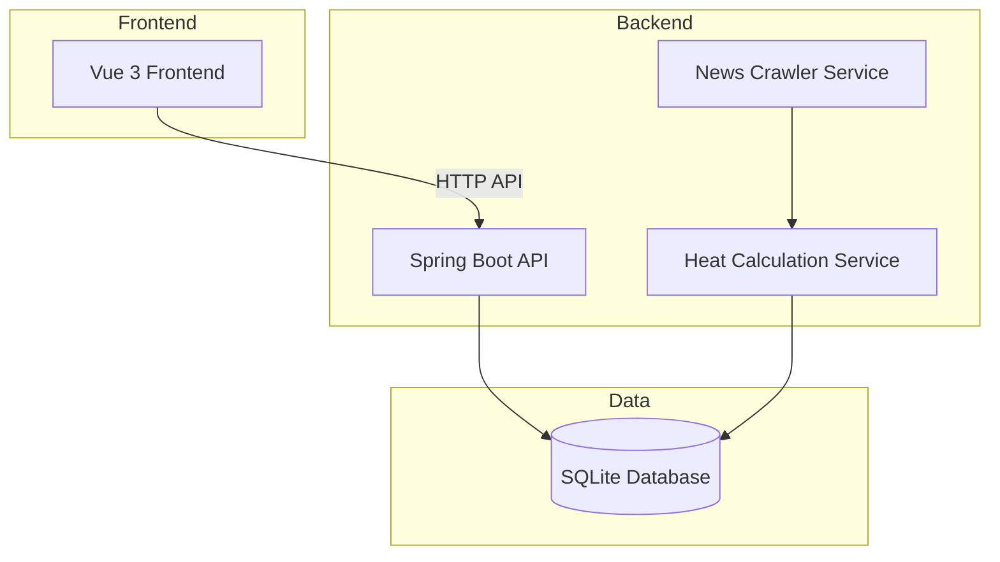
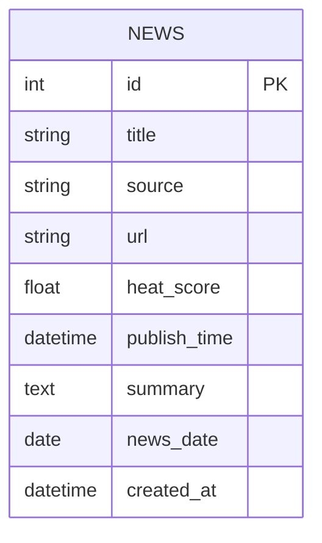

# AI新闻热点 - 技术架构文档

## 1. 架构设计



## 2. 技术栈

| 层级 | 技术 | 说明 |
|------|------|------|
| 前端 | Vue 3 + Vite | 现代化前端框架 |
| 前端样式 | CSS Variables | 原生CSS变量，支持深色主题 |
| 后端 | Spring Boot 3.x | Java 17+ 后端框架 |
| 后端数据 | Spring Data JPA | ORM框架 |
| 数据库 | SQLite | 轻量级嵌入式数据库 |
| 网络 | RestTemplate | HTTP客户端 |
| XML解析 | Jsoup | HTML/XML解析 |

## 3. 路由定义

### 3.1 前端路由

| 路由 | 页面 | 说明 |
|------|------|------|
| / | HomeView | 首页，展示热点新闻 |
| /history | HistoryView | 历史新闻浏览 |

### 3.2 后端API

| 接口 | 方法 | 说明 |
|------|------|------|
| /api/news/today | GET | 获取当日热点新闻 |
| /api/news/history/{date} | GET | 获取指定日期新闻，date格式：yyyy-MM-dd |
| /api/news/crawl | POST | 触发手动抓取（仅演示用） |

## 4. API定义

### 4.1 获取当日新闻

```
GET /api/news/today

Response:
{
  "code": 200,
  "data": [
    {
      "id": 1,
      "title": "OpenAI发布GPT-5",
      "source": "TechCrunch",
      "url": "https://example.com/news/1",
      "heatScore": 95.5,
      "publishTime": "2024-01-15 10:30:00",
      "summary": "..."
    }
  ],
  "message": "success"
}
```

### 4.2 获取历史新闻

```
GET /api/news/history/2024-01-14

Response: 同上
```

## 5. 数据模型

### 5.1 ER图



### 5.2 DDL

```sql
CREATE TABLE IF NOT EXISTS news (
    id INTEGER PRIMARY KEY AUTOINCREMENT,
    title VARCHAR(500) NOT NULL,
    source VARCHAR(100),
    url VARCHAR(1000),
    heat_score DECIMAL(5,2),
    publish_time DATETIME,
    summary TEXT,
    news_date DATE,
    created_at DATETIME DEFAULT CURRENT_TIMESTAMP
);

CREATE INDEX idx_news_date ON news(news_date);
CREATE INDEX idx_heat_score ON news(heat_score);
```

## 6. 项目结构

```
ai-news-portal/
├── src/main/java/com/ainews/portal/
│   ├── AinewsPortalApplication.java
│   ├── controller/
│   │   └── NewsController.java
│   ├── service/
│   │   ├── NewsService.java
│   │   └── NewsCrawlerService.java
│   ├── entity/
│   │   └── News.java
│   ├── repository/
│   │   └── NewsRepository.java
│   └── config/
│       └── CorsConfig.java
├── src/main/resources/
│   ├── application.yml
│   └── data.db (SQLite)
├── src/main/vue/
│   ├── index.html
│   ├── package.json
│   ├── vite.config.js
│   └── src/
│       ├── main.js
│       ├── App.vue
│       ├── views/
│       │   └── HomeView.vue
│       └── components/
│           └── NewsCard.vue
└── pom.xml
```

## 7. 核心业务逻辑

### 7.1 热度计算

热度指数 = (浏览量权重 × 0.3 + 来源权重 × 0.2 + 时效性权重 × 0.3 + 关键词匹配 × 0.2)

### 7.2 定时任务

每日凌晨2点自动抓取最新新闻数据
